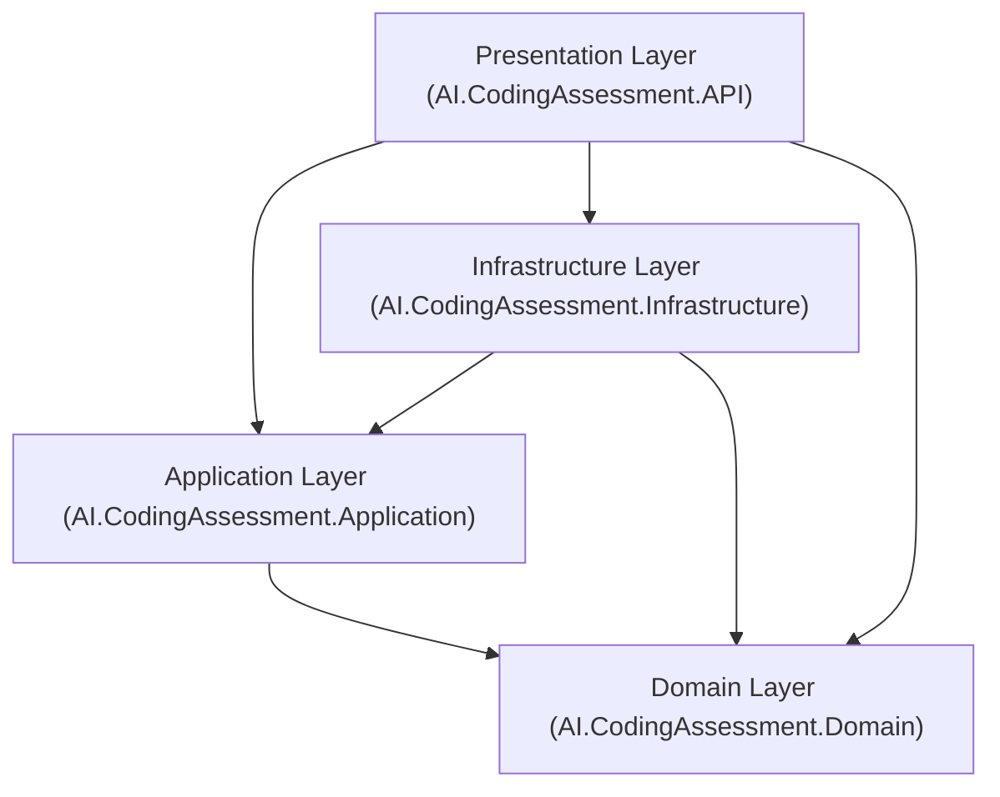
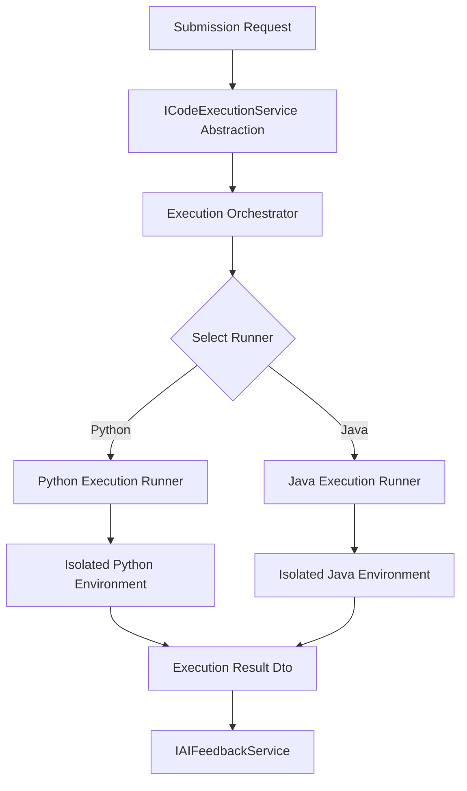
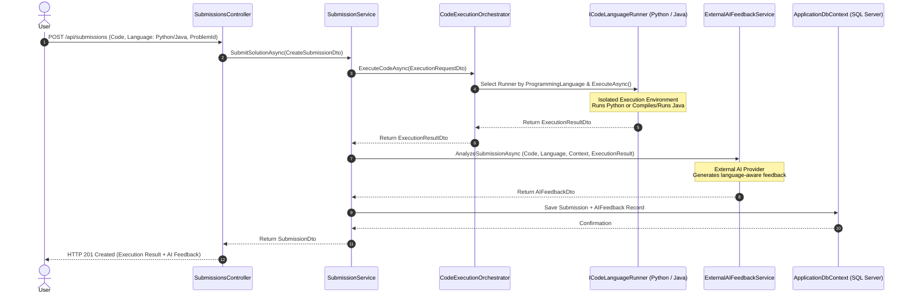

# System Architecture Documentation: AI Coding Assessment Platform

## Overview

The **AI Coding Assessment Platform** is built adhering strictly to the principles of **Clean Architecture** (Onion Architecture / Hexagonal Architecture). This design decouples the core domain models and business logic from external frameworks, user interfaces, database persistence layers, code execution environments, and third-party AI services.

The platform supports multi-language candidate submission starting with **Python** and **Java**, orchestrated via pluggable language execution runners behind a language-agnostic interface.

---

## Architectural Principles & Layer Boundaries

### 1. Domain Layer (`AI.CodingAssessment.Domain`)
- **Responsibility**: Represents enterprise domain concepts, core entities, enumerations, and repository contracts.
- **Dependencies**: Zero internal project dependencies.
- **Key Artifacts**:
  - `User`, `Problem`, `TestCase`, `Submission`, `AIFeedback`
  - `UserRole`, `DifficultyLevel`, `SubmissionStatus`, `ProgrammingLanguage` (Python, Java)
  - `IRepository<T>`, `IUserRepository`, `IProblemRepository`, `ITestCaseRepository`, `ISubmissionRepository`, `IAIFeedbackRepository`

### 2. Application Layer (`AI.CodingAssessment.Application`)
- **Responsibility**: Contains use-case interfaces, service contracts, data transfer objects (DTOs), validation logic, and custom application exceptions.
- **Dependencies**: Depends ONLY on `AI.CodingAssessment.Domain`.
- **Key Artifacts**:
  - `IAuthService`, `IProblemService`, `ITestCaseService`, `ISubmissionService`, `IUserService`
  - Abstractions for external services: `ICodeExecutionService`, `ICodeLanguageRunner`, `IAIFeedbackService`
  - DTO records for request/response payloads (`ExecutionRequestDto`, `ExecutionResultDto`, `TestCaseResultDto`)

### 3. Infrastructure Layer (`AI.CodingAssessment.Infrastructure`)
- **Responsibility**: Handles data access via Entity Framework Core (`ApplicationDbContext`), repository implementations, SQL Server configuration, and external integration adapters.
- **Dependencies**: Depends on `AI.CodingAssessment.Application` and `AI.CodingAssessment.Domain`.
- **Key Artifacts**:
  - `ApplicationDbContext` & Fluent API Configurations
  - Concrete Repositories (`UserRepository`, `ProblemRepository`, etc.)
  - Code Execution Orchestrator (`CodeExecutionOrchestrator`) & Language Runners (`PythonExecutionService`, `JavaExecutionService`)
  - External Service Implementations (`ExternalAIFeedbackService`)

### 4. Presentation / API Layer (`AI.CodingAssessment.API`)
- **Responsibility**: ASP.NET Core Web API controllers, request routing, Swagger/OpenAPI, authentication/authorization pipelines, and global exception handling middleware.
- **Dependencies**: Registers and glues `Application`, `Infrastructure`, and `Domain` via Dependency Injection in `Program.cs`.

---

## Multi-Language Code Execution Architecture

Candidate code execution is completely isolated from the main Web API process. Execution requests are routed to language-specific runners based on the `ProgrammingLanguage` enum.

### Execution Flow & Language Runners

#### Python Execution Flow
1. Receive Python source code & test cases.
2. Instantiate isolated execution environment / sandbox.
3. Stream test-case input to Python interpreter process.
4. Capture `stdout` / `stderr`.
5. Compare actual output against expected output.
6. Record execution time (ms) and peak memory usage (KB).
7. Enforce time limit (e.g. 2000ms) and memory limit (e.g. 256MB).
8. Return unified `ExecutionResultDto`.

#### Java Execution Flow
1. Receive Java source code & test cases.
2. Instantiate isolated execution environment / sandbox.
3. Invoke Java compiler (`javac`).
4. If compilation fails: Return `SubmissionStatus.CompilationError` with compiler error diagnostics.
5. Execute compiled Java byte code (`java`).
6. Stream test-case input, capture `stdout` / `stderr`.
7. Compare actual output against expected output.
8. Record execution time (ms) and peak memory usage (KB).
9. Enforce time limit and memory limit.
10. Return unified `ExecutionResultDto`.

---

## Updated Submission Sequence Diagram

---

## Centralized Error Handling & HTTP Mapping

Global error handling is centralized in `ExceptionHandlingMiddleware` mapped as follows:

| Exception Type | HTTP Status Code | Description |
| :--- | :--- | :--- |
| `ValidationException` | `400 Bad Request` | DTO or business validation failure |
| `UnauthorizedException` | `401 Unauthorized` | Invalid or missing authentication credentials |
| `UnauthorizedAccessException` | `403 Forbidden` | Insufficient role or permission |
| `NotFoundException` | `404 Not Found` | Requested domain entity does not exist |
| `CodeExecutionException` | `422 Unprocessable Entity` | Sandbox or execution engine fault |
| `AIServiceException` | `502 Bad Gateway` | External AI API connectivity or formatting issue |
| `Exception` (Unhandled) | `500 Internal Server Error` | System exception |
